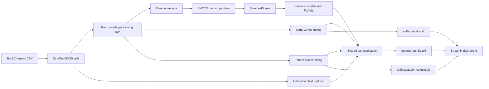

# Architecture

## Purpose

The project trains binary classifiers for customer churn and serves batch predictions through Streamlit. The positive class is `Attrited Customer` (`1`); `Existing Customer` is `0`.

## System view

## Components

### Training pipeline

[`train.py`](../train.py) handles data loading, label encoding, the shared split, classical preprocessing, training, evaluation, timings, and bundle serialization.

It selects the 19 feature columns at positions 2 through 20. `Attrition_Flag` and `CLIENTNUM` are not model features. The split is stratified, uses a 20% test partition, and has random seed 42.

### Foundation-model integration

[`foundation_models.py`](../foundation_models.py) isolates optional GPU dependencies and model-specific behavior:

- Mitra-v2 downloads a pinned classifier checkpoint and fine-tunes it through AutoGluon.
- TabFM downloads pinned classification weights, fits a local context, and predicts in bounded chunks.
- CUDA imports are lazy, so the classical pipeline and dashboard can start without the optional model packages.
- `release_cuda()` clears Python and PyTorch caches between foundation models.

### Application

[`app.py`](../app.py) loads the bundle, validates uploaded CSV or XLSX data, and routes each selected model through its matching preprocessing path. Foundation models load and release sequentially because both cannot remain in 8 GB of GPU memory together.

The dashboard only lists a foundation model when its artifact path exists. This allows the Docker image to include Mitra-v2 while leaving the local-only TabFM context out.

## Processing boundaries

| Concern | Classical and FLAML | Mitra-v2 | TabFM |
|---|---|---|---|
| Input | One-hot encoded numeric matrix | Raw mixed-type DataFrame | Raw mixed-type DataFrame |
| Class balancing | SMOTE on training data | None | None |
| Scaling | StandardScaler | None | None |
| GPU required | No | Yes | Yes |
| Persisted state | Estimator in bundle | AutoGluon artifact directory | Training context in Joblib file |
| Deployment scope | Local and Docker | Local and Docker | Local non-commercial research only |

## Reproducibility and trust boundaries

- The target mapping, split seed, model revisions, metrics, and timing data are stored explicitly.
- Resampling and scaling are fit only on the training partition.
- Every model is evaluated against the same untouched test partition.
- The benchmark uses a single holdout evaluation. It does not include cross-validation and does not predict production performance.
- TabFM source is Apache-2.0, but the pretrained weights use a non-commercial research license.
